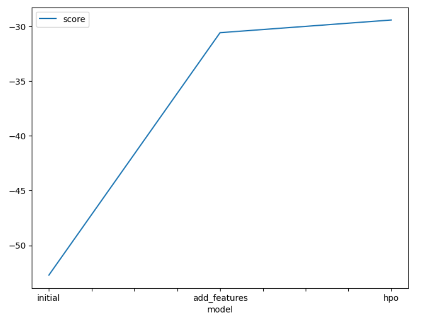
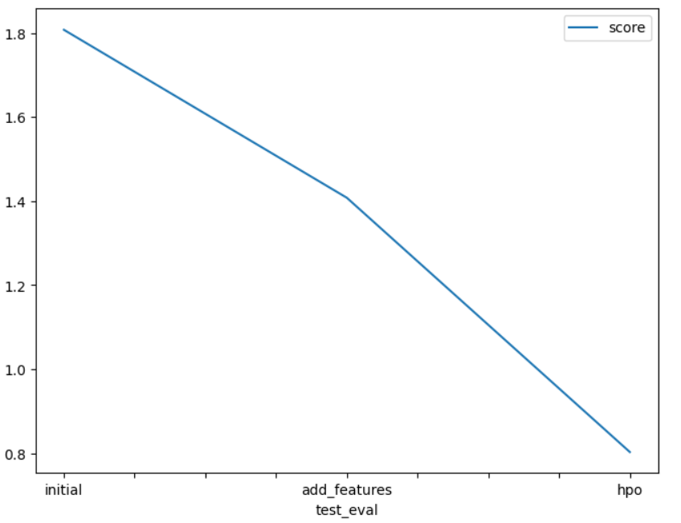

# Report: Predict Bike Sharing Demand with AutoGluon Solution
Samruddhi Kashmire

## Initial Training
### What did you realize when you tried to submit your predictions? What changes were needed to the output of the predictor to submit your results?
All the negative predictions should be made zero before submitting .

### What was the top ranked model that performed?
WeightedEnsemble_L3 

## Exploratory data analysis and feature creation
### What did the exploratory analysis find and how did you add additional features?
By separating out the datetime into hour, day, or month parts.

### How much better did your model preform after adding additional features and why do you think that is?
the diffrence between the first model's score and the second is nearly 20% % . By giving additional features to the model our model learned the features more better.

## Hyper parameter tuning
### How much better did your model preform after trying different hyper parameters?
The model performed 1% better.

### If you were given more time with this dataset, where do you think you would spend more time?
I would like to learn more about the data and do EDA more on it to understand.

### Create a table with the models you ran, the hyperparameters modified, and the kaggle score.
|model|score|
|--|--|
|initial|-52.718995|
|add_features|-30.580853|
|hpo|-29.425810|

### Create a line plot showing the top model score for the three (or more) training runs during the project.

### Create a line plot showing the top kaggle score for the three (or more) prediction submissions during the project.

## Summary
According to me the model performed best when used hyperprameters and also way better when we added the more features.
